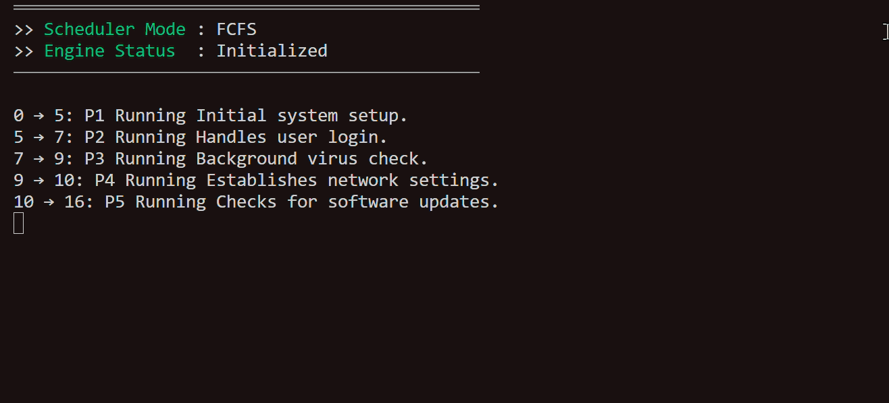
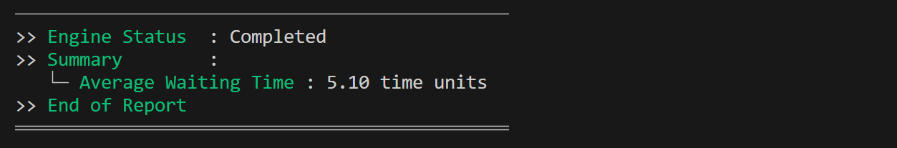

# CPU Scheduler Simulator ⏰  

🖥️ C program that simulates a CPU scheduler using Unix signals and process forking

## Table of Contents  

1. [About](#about)  
2. [Features](#features)  
3. [Requirements](#requirements)  
4. [Installation](#installation)  
5. [Usage](#usage)  

---

## About

The **CPU Scheduler Simulator** is a C program that simulates the execution of multiple processes under different scheduling algorithms.  
Each process runs as a separate child process, and the program tracks CPU allocation, waiting times, and completion times.

This project demonstrates **process creation (`fork`)**, **signal handling (`SIGCONT`/`SIGSTOP`)**, and **timing of CPU execution slices**, providing a practical implementation of basic operating system scheduling concepts.

---

## Features

- Implements multiple CPU scheduling algorithms (FCFS, SJF, Priority, Round Robin)  
- Tracks **waiting time**, **turnaround time**, and **completion time** for each process  
- Simulates process execution using child processes and **signals**  
- Handles CPU idle periods and logs all process events  
- Outputs detailed **timeline of execution** and **summary reports**  
- Supports configurable **time quantum** for Round Robin scheduling

---

## Requirements

- Linux, macOS, or Windows with WSL  
- GCC (GNU Compiler Collection) or another C compiler supporting C11  
- Make (to build and run the project)  
- Git (to clone the repository)  

---

### 1. Clone the repository
```bash
git clone https://github.com/Amit-Bruhim/OS-Scheduler-Simulator.git
```

### 2. Navigate into the project folder
```bash
cd OS-Scheduler-Simulator
```

### 3. Compile and Run the program using Make
```bash
make run
```

---

## Usage

For demonstration purposes, we will use the following processes:

| Process | Description                     | Arrival Time | Burst Time | Priority |
|---------|---------------------------------|--------------|------------|----------|
| P1      | Initial system setup            | 0            | 5          | 3        |
| P2      | Handles user login              | 1            | 2          | 4        |
| P3      | Background virus check          | 1            | 2          | 4        |
| P4      | Establishes network settings    | 3            | 1          | 5        |
| P5      | Checks for software updates     | 5            | 6          | 2        |
| P6      | Indexes system files in background | 5         | 2          | 3        |
| P7      | Manages active user session     | 6            | 3          | 4        |
| P8      | Delivers system alerts          | 6            | 1          | 2        |
| P9      | Schedules data backup routines  | 20           | 5          | 1        |
| P10     | Monitors battery and power state | 10          | 2          | 3        |

**Explanation of columns:**  
- **Arrival Time** – the time at which the process enters the system  
- **Burst Time** – the total time the process requires on the CPU  
- **Priority** – lower numbers indicate higher priority  

When the program is run, for each scheduling algorithm, the simulator will print when a process starts executing.  
Then, in real time, it prints which process is running according to the current time and burst duration, for example:

  

At the end of each algorithm, the program prints summary data, for example:

  

> **Note:** For convenience, the repository already includes the process data above, and the time quantum for Round Robin is set to 2. Users can modify these values if desired.


